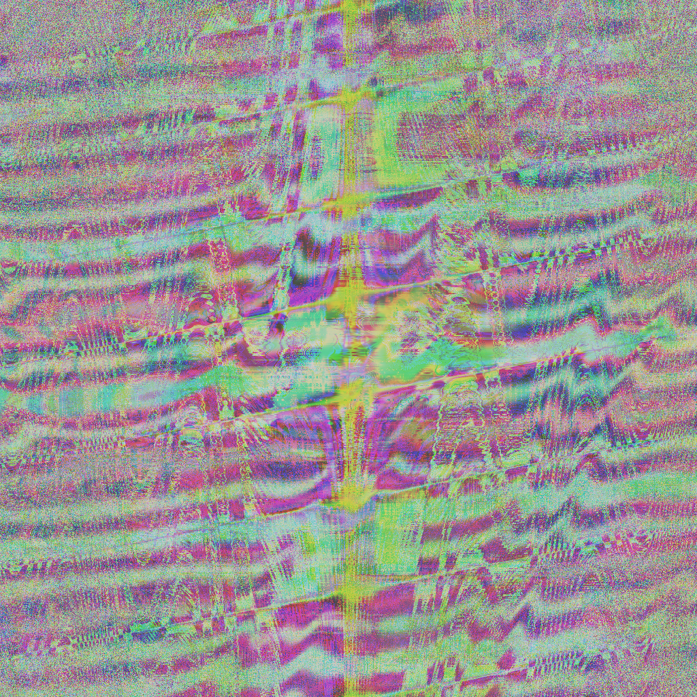
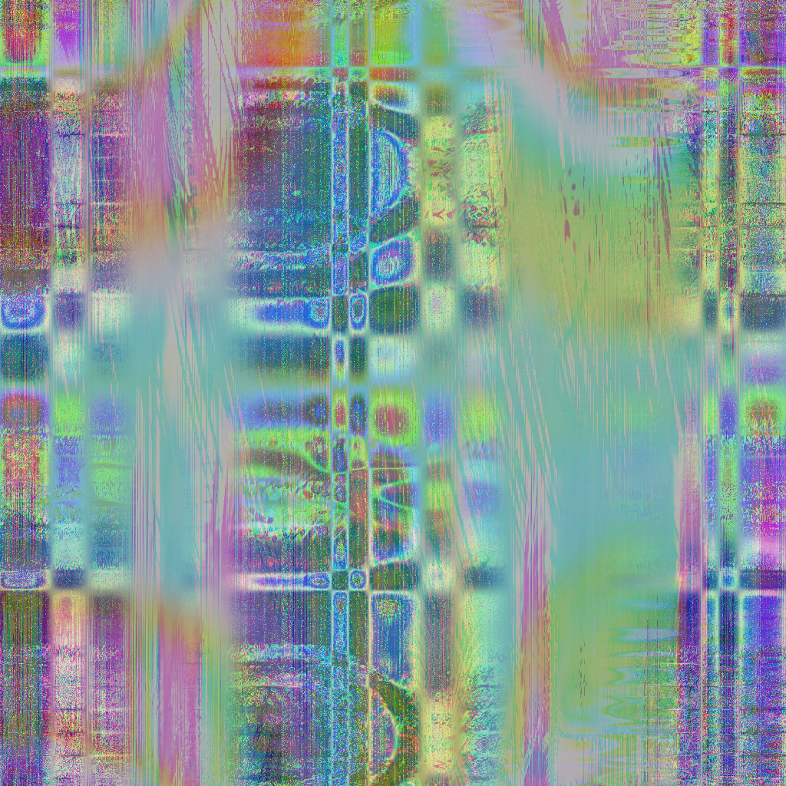

# generative art machine

I wanted a way to produce album art for [the music](https://soundcloud.com/the-atomic-music-machine) I make. I'm not very visually
artistic so this tool(or toy) is a way to enhance my capabilities as an artist. This repo contains code I threw together to produce visually
appealing art (to me) that I can use for album art. Hope it's useful or fun for
someone else :)

# installing

Install the regular golang environment, then run:

```
go build -o art_generator .
./art_generator
Server is running at http://localhost:8080
```

# generating art

Making art is simple. Think of a word, phrase or random selection of characters
as your seed. Place it in the box and click Generate. 

Please keep in mind that this code is experimental and is multi-threaded, it
will push your CPU to its limits. Keeping the size smaller will reduce the
amount of pixels the CPU has to assemble. I like to use the smaller sizes to
find a seed I like and then crank it up to produce a higher resolution version.

# examples

Seed: `adamenger`



Seed: `supercalifragilisticexpialidocious`


Seed: `hootenanny`



# credits

I was inspired by
[https://www.random-art.org/about/](https://www.random-art.org/about/) and this [Python
implementation](http://math.andrej.com/2010/04/21/random-art-in-python/).
